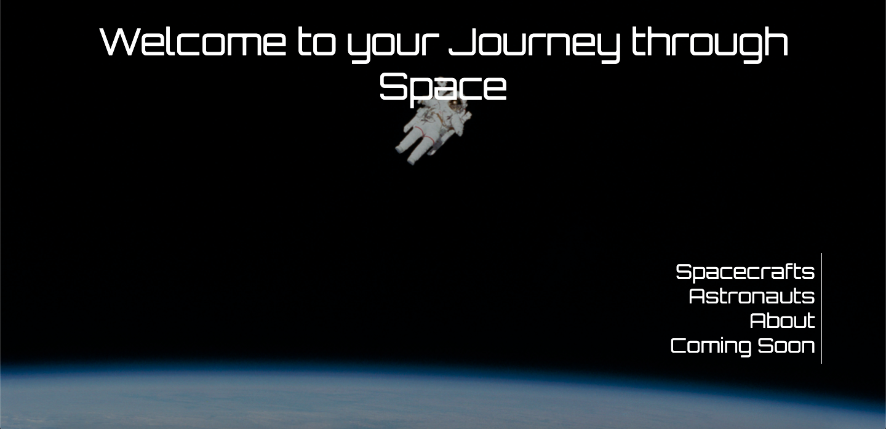
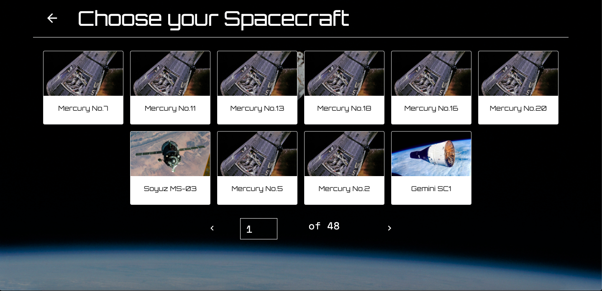
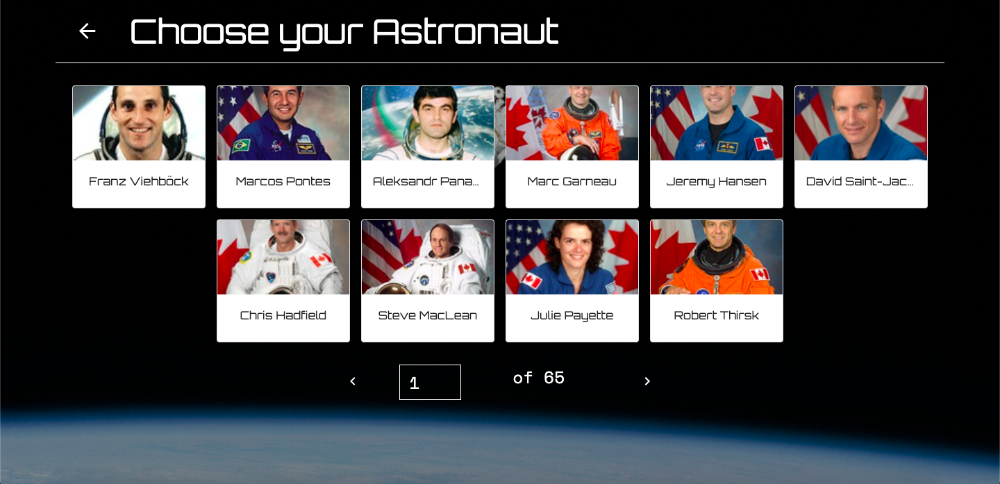
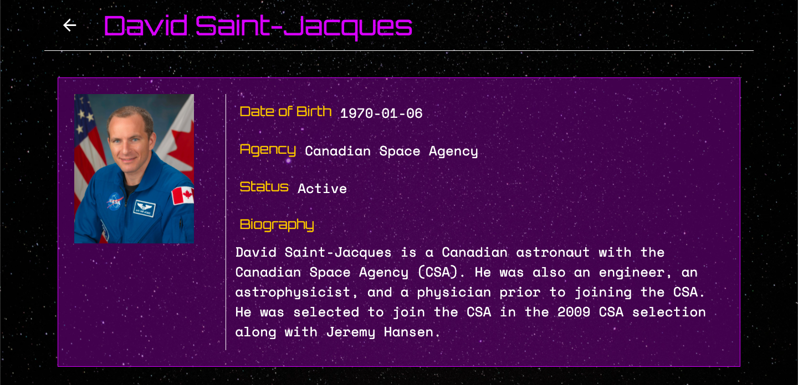

  <h1>🌎 CCC WebJam 21-I</h1>

  <a href="https://github.com/web-jam-g12/space-jam#Project">Submission</a> ·
  <a href="https://github.com/web-jam-g12/space-jam#Images">Images</a> ·
  <a href="https://github.com/web-jam-g12/space-jam#Team">Team</a> ·
  <a href="https://github.com/web-jam-g12/space-jam#Technologies">Technologies</a> ·
  <a href="https://github.com/web-jam-g12/space-jam#Comments">Comments</a>

  
  
  
  

## 🎨 Project

**Project Number: 12**

Space Jam allows you to access different information about real spacecrafts and astronauts, provided by the [Space Devs public API](https://ll.thespacedevs.com/).

## 🎒 Submission

* [ ] [Website URL](https://spacejam.ml/)
* [ ] [Source Code URL](https://github.com/web-jam-g12/space-jam)

## 🖼️ Images

  
  
  
  
  

## 👪 Team

||Name|University|Username
|-|-|-|-
|#1|Bárbara Irarrázaval|Pontificia Universidad Católica|[@barbaraim](https://github.com/barbaraim)
|#2|Humberto Ortúzar|Pontificia Universidad Católica|[@humbertoortuzar](https://github.com/humbertoortuzar)
|#3|Andrés Pincheira|Pontificia Universidad Católica|[@arpincheira](https://github.com/arpincheira)
|#4|Moisés Retamal|Pontificia Universidad Católica|[@meretamal](https://github.com/meretamal)

## 🏗️ Technologies

To develop this website we used React + Redux.

## 💬 Comments

The website is fully responsive, so don't be afraid to check it out through your phone 😄.
